# Evidencias de la práctica

## 1. Entorno levantado

- Captura de JupyterLab

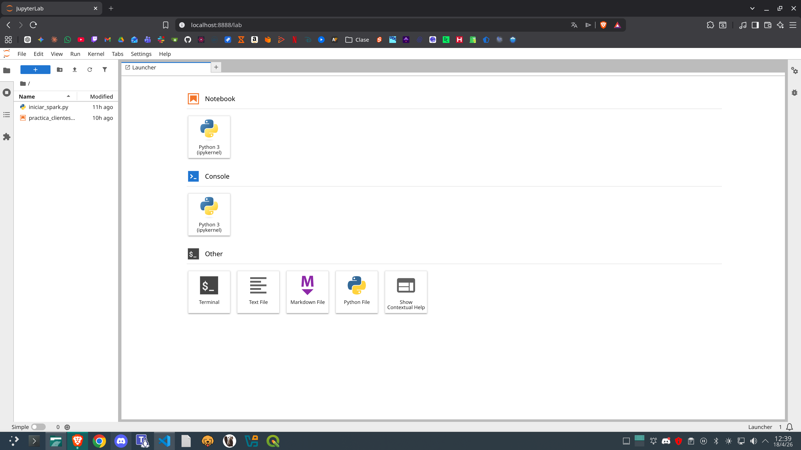

- Captura del Spark Master UI

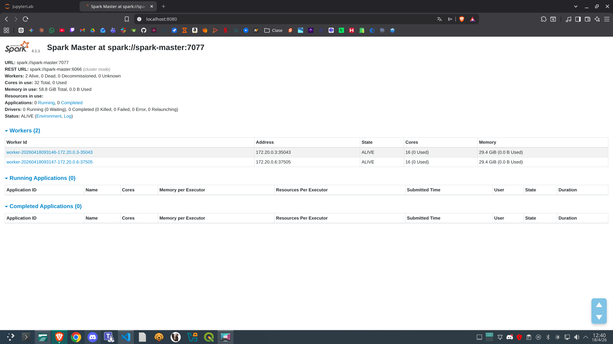

## 2. Lectura de datos

- Esquema de `clientes`, esquema de `pedidos` y muestra inicial de datos

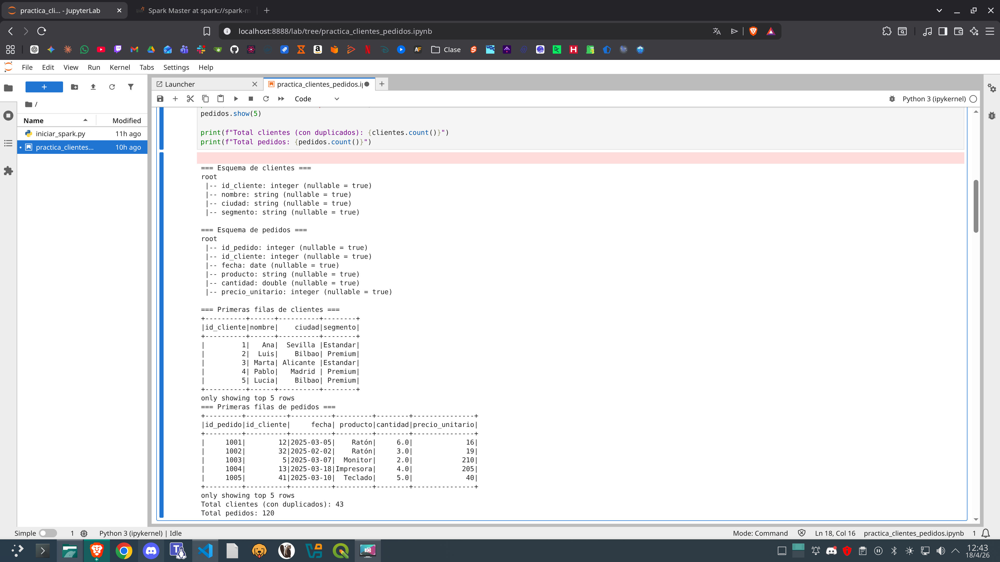

## 3. Limpieza

- Resultado tras `trim` y eliminación de duplicados (43 → 40)

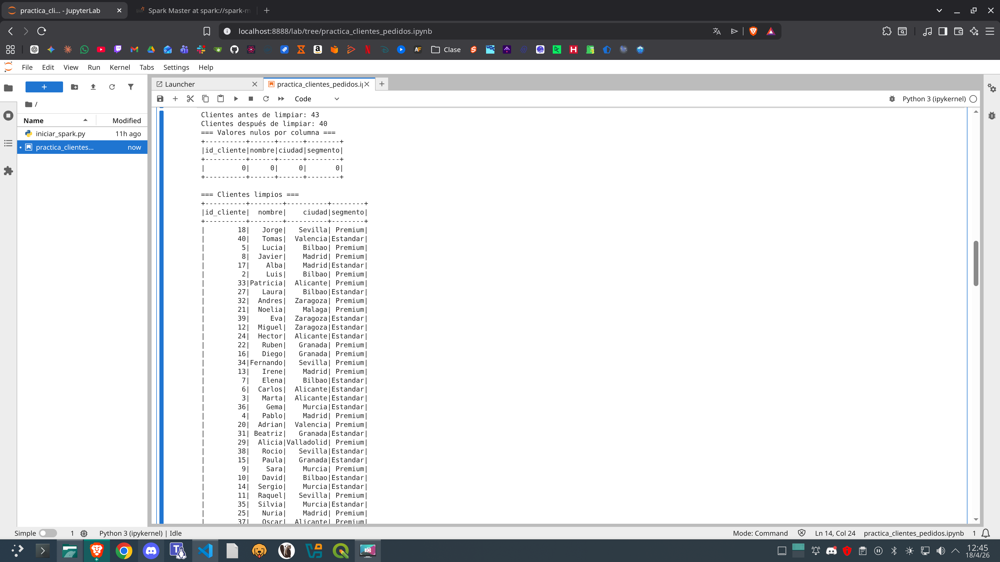

- Tratamiento de valores nulos en pedidos y esquema tras conversión de tipos

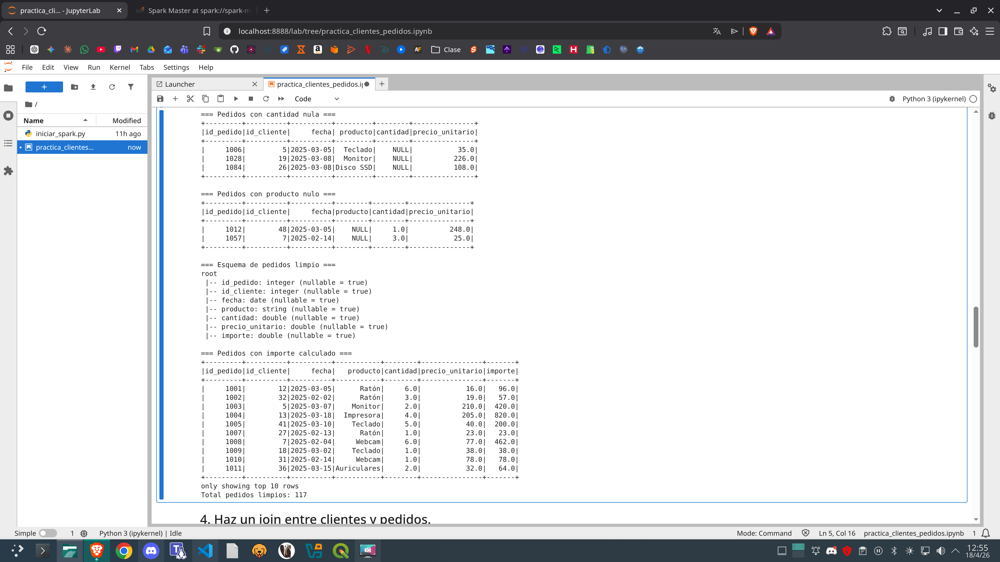

## 4. Join

- Resultado del join entre clientes y pedidos y explicación de los registros perdidos

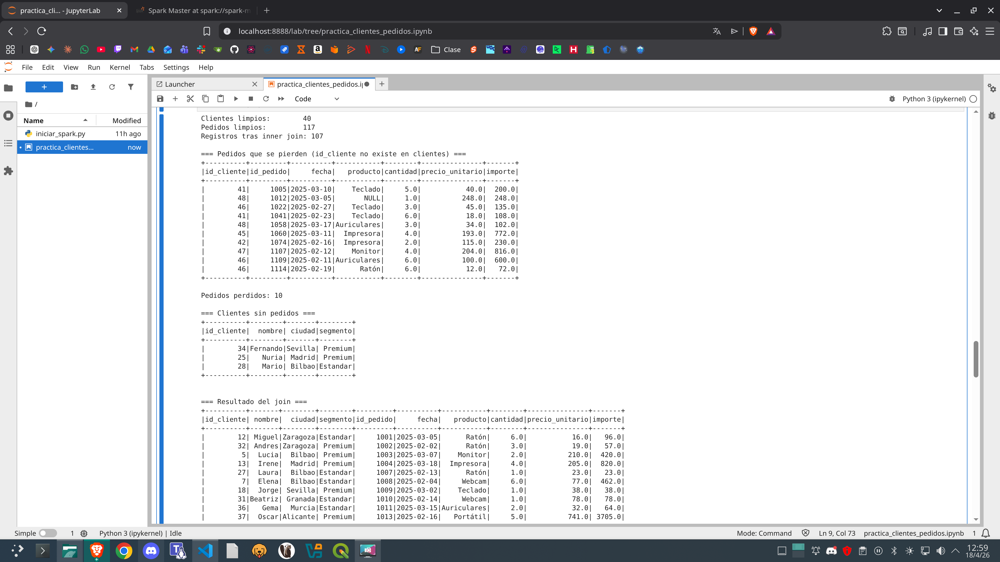

## 5. Agregaciones

- Ventas Premium con importe >= 100

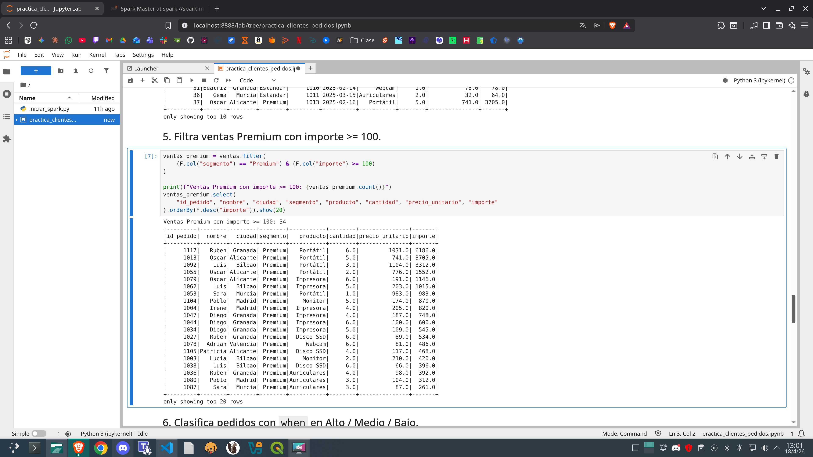

- Clasificación de pedidos con `when` en Alto / Medio / Bajo

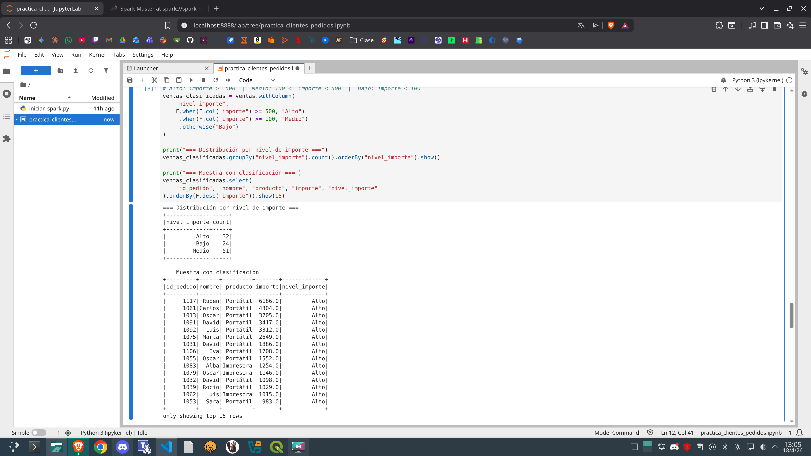

- Resumen por ciudad y segmento

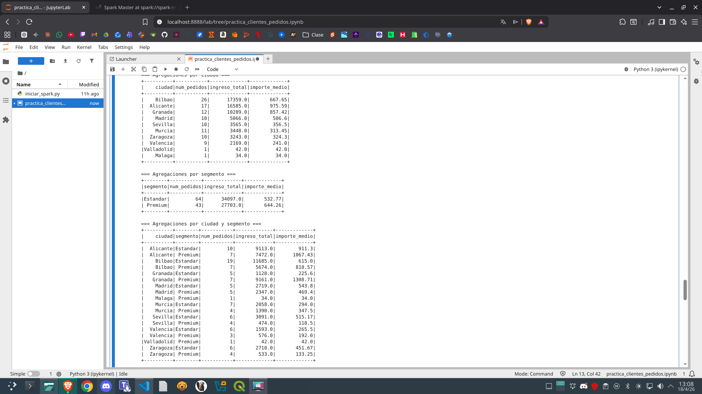

## 6. SQL

- Consulta SQL realizada y resultado obtenido

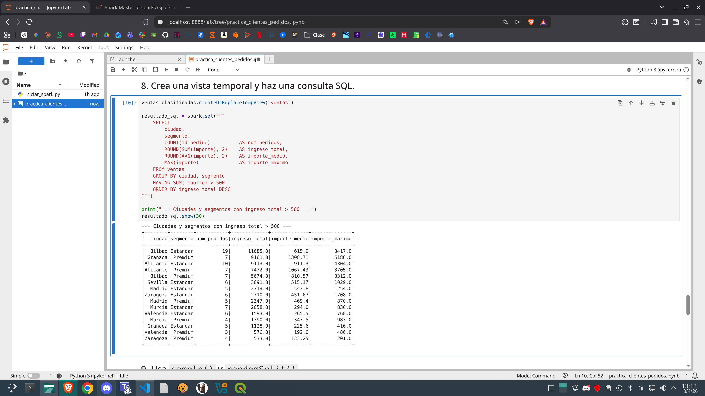

## 7. Parquet

- Escritura del resultado y lectura posterior del fichero Parquet

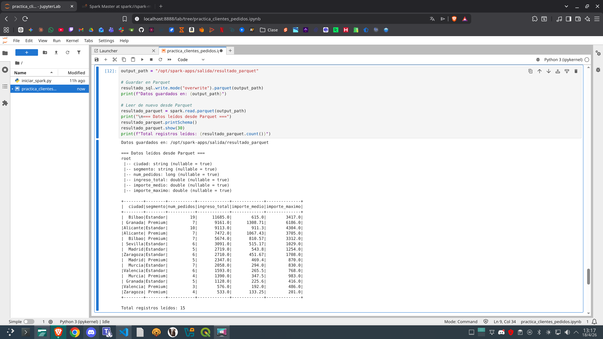

- Muestreo con `sample()` y partición con `randomSplit()`

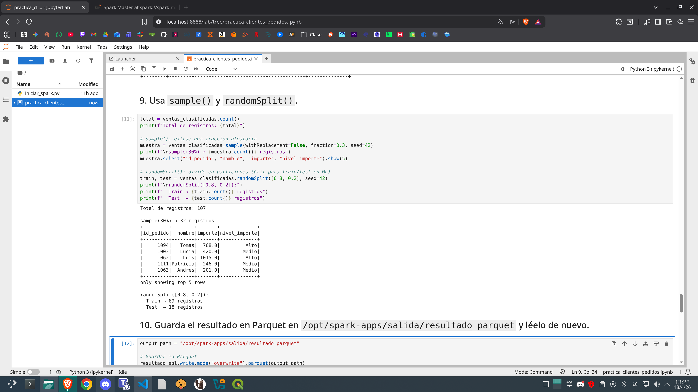
